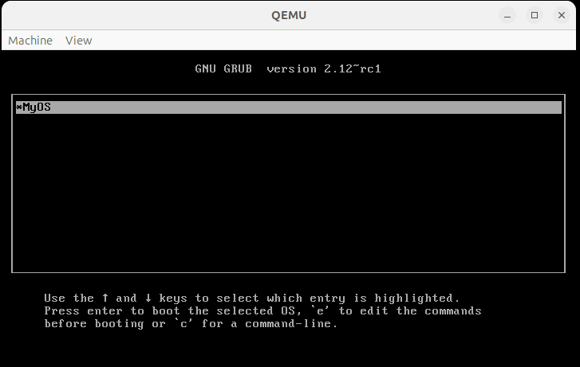

<div align="center">
  
</div> 


### Simple kernel in asm, C

A simple operating system project showcasing basic OS development concepts.

```
.
├── src
│   ├── kernel.c        # Kernel code
│   ├── multiboot.S   # Multiboot bootloader
│   └── link.ld         # Linker script
└── README.md
```
### Building the kernel
We will now create object files from <code>mutliboot.S</code> and <code>kernel.c</code> and then link it using our linker script.

<pre>
nasm -f elf32 multiboot.S -o kasm.o
</pre>

Now we will run the assembler to create the object file <code>kasm.o</code> in ELF-32 bit format.

<pre>
gcc -m32 -c kernel.c -o kc.o
</pre>

Now the linking part,

<pre>
ld -m elf_i386 -T link.ld -o kernel kasm.o kc.o
</pre>

##Now run your kernel
We will now run the kernel on the <code>qemu</code> emulator.

<pre>
qemu-system-i386 -kernel kernel
</pre>

That's it.
